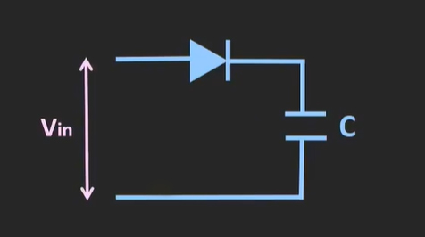

## 前言

本篇博客用来记录本人学习电路过程一些电路知识点或者概念。

---

## 带宽

###  定义
带宽是指信号传输过程中能够传递的频率范围，通常以赫兹（Hz）为单位。带宽越大，能够传输的信息量就越多。

### -3 dB 带宽
通常通过 **-3 dB** 作为信号功率下降到最大功率的一半（50%）来定义带宽，这也叫 **半功率带宽**。

### UWB（Ultra-Wideband，超宽带）
在 UWB 通信中，带宽 主要指 信号所占的频率范围（≥ 500 MHz），它决定了 UWB 的 定位精度、数据传输速率 和 抗干扰能力。UWB 依靠超大带宽和超短脉冲，能够实现 厘米级定位，这使其在 智能手机、汽车无钥匙进入（UWB Key）、物联网（IoT） 等领域有广泛应用。 

##  耦合方式

耦合是指信号在电路中如何传递的方式，主要分为直流耦合和交流耦合。

### 直流耦合

#### 定义
直流耦合是指信号的直流成分和交流成分都可以通过电路传递。

### 交流耦合

####  定义
交流耦合是指只允许信号的交流成分通过，而阻止直流成分的传递。

耦合电容：常使用电容器进行耦合。

#### 电容的工作原理
电容器在交流信号中表现出低阻抗特性，能够允许高频交流信号通过，而对直流信号则表现出高阻抗特性。具体来说：
- **交流信号**：电容器会随着交流电压的变化而充放电，形成电流，从而允许交流信号通过。
- **直流信号**：一旦电容器充满电，它会阻止直流电流的流动，因此直流信号无法通过。
**电容的阻抗随频率变化**  
   电容的 **阻抗 \(X_C\)** 由以下公式决定：  
   $$
   X_C = \frac{1}{2\pi f C}
   $$
   其中：
   -  X_C ：电容对信号的阻抗（单位：欧姆 Ω）
   -  f ：信号频率（单位：赫兹 Hz）
   -  C ：电容值（单位：法拉 F）

   **阻抗特性：**
   - **频率  f  高** → 阻抗  X_C **小** → **信号容易通过**  
   - **频率  f  低（直流 f = 0 ）** → 阻抗  X_C  **无穷大** → **信号被阻断** 

### 直流耦合与交流耦合的比较

| 特性           | 直流耦合             | 交流耦合             |
|----------------|----------------------|----------------------|
| 直流成分       | 通过                 | 阻止                 |
| 频率响应       | 0 Hz 起               | 从某个截止频率开始  |
| 使用元件       | 放大器、运算放大器等 | 电容器              |
| 应用领域       | 直流信号测量         | 音频处理、信号隔离  |

## PLL
### 工作原理
PLL（Phase-Locked Loop，相位锁定环路）。PLL 的核心思想是通过一个反馈控制系统使得输出信号的相位（或者频率）与输入信号的相位（或频率）保持一致。

简单来说，PLL包括三个主要组件：
- 相位比较器（Phase Comparator, PC）：它比较输入信号和输出信号的相位差异。

- 低通滤波器（Low Pass Filter, LPF）：滤除高频噪声并将相位比较器的输出转换为一个平稳的直流信号。
- 压控振荡器（Voltage-Controlled Oscillator, VCO）：它根据低通滤波器输出的信号调节其输出频率，直到输出信号的相位与输入信号对齐。
  
过程：
- 输入信号：有一个频率已知的信号（可以是正弦波或者方波等），比如来自于一个外部时钟。
- 相位比较：PLL 中的相位比较器将输入信号和 VCO 的输出信号进行比较，计算它们之间的相位差异（也叫“相位误差”）。
- 调整输出：相位误差会被传递到低通滤波器，滤波器会平滑这个信号并调整VCO的频率，使其输出信号的相位逐步调整，直到两者的相位一致（锁定）。
- 锁定状态：一旦相位锁定，VCO 就会保持与输入信号的频率和相位一致。

形象理解：
想象你在跟一个朋友一起跳舞。你的朋友在跳固定的舞步（输入信号），而你最开始的舞步可能跟不上他的节奏。为了和他同步，你会通过观察他的动作，逐渐调整自己的步伐，直到你和他完全同步。这个过程就像PLL工作原理一样，最终你和他保持一致的舞步，也就是“锁定”。

### 作用
- 信号同步：PLL 能够将多个信号源同步，例如在多通道通信系统中，PLL 保证各通道的时钟同步。
- 抑制噪声：PLL 可以用来从噪声中提取稳定的频率信号，广泛应用于信号调制解调、滤波等。

## 二极管峰值电压检测

  

二极管峰值电压检测原理主要依赖于二极管的单向导电特性和电容器电压不易突变的特性。当输入电压增加时，二极管开始导通，电容器开始充电，电容电压随着输入电压的增加而逐步上升，直到输入电压达到峰值。当输入电压减小时，二极管进入截止状态，电容器电压保持在之前的最大值，即输入信号的峰值电压。这是因为二极管截止后阻止了电流的反向流动，电容器不会放电或发生显著变化。只有当输入电压再次增大并超过之前的峰值时，二极管才会再次导通，电容器的电压才会继续增加，记录下新的峰值。通过检测电容器两端的电压，我们可以得到输入信号的最大电压（峰值）。
这个过程确保了我们能够准确地捕捉到输入信号的峰值电压，而电容器的电压始终保持在信号的最大值，直到新的峰值出现。

## 未完待续...
本篇博客会持续更新

[def]: 第一篇博客/wallhaven-7pz66y.jpg