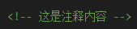

## 前言
我是威风的小蝎子，这是我的第一篇博客，该博客使用hexo（博客生成框架）+github（文件托管平台）+ netlifly（站点部署服务）+cloudflare（访问加速服务）搭建，参考教程为-https://blog.cuijiacai.com/blog-building/
，博客搭建完成之后的任务是美化博客以及博客写作，该博客写作使用的是Markdown语言，下面对Markdown以及相关语法做简单介绍。
## Markdown介绍
Markdown 是一种轻量级标记语言，用于使用纯文本编写格式化内容，非常适合文档、博客和版本控制系统（如 GitHub）。
## 相关语法

### 标题
```markdown 语法
# 一级标题
## 二级标题
### 三级标题
#### 四级标题
```
效果:
<div style="text-align: left;">
  
</div>

### 文本编辑

```markdown 语法

加粗： **加粗** 或 __加粗__

斜体： *斜体* 或 _斜体_

删除线： ~~删除线~~
```
效果：
**加粗** 或 __加粗__

 *斜体* 或 _斜体_

 ~~删除线~~

### 列表
#### 无序列表
``` markdown 语法
- 项目 1
  - 子项目 1
- 项目 2
```
效果：
- 项目 1
  - 子项目 1
- 项目 2
#### 有序列表
``` markdown 
1. 第一项
2. 第二项
   1. 子项
3. 第三项
```
效果：
1. 第一项
2. 第二项
   1. 子项
3. 第三项
### 链接与图片
``` markdown
链接：[我的github主页](https://github.com/exturyckt)
图片：
```
效果：
[我的github主页](https://github.com/exturyckt)

图片：

### 代码
```
`行内代码`
```
效果：
`行内代码`

```
​```python
def hello_world():
    print("你好，世界！")
```

```python
def hello_world():
    print("你好，世界！")
```

### 引用
``` mMrkdown
> 这是一个引用。
```
效果：
> 这是一个引用。

### 表格
```
| 列 1     | 列 2     | 列 3     |
|----------|----------|----------|
| 数据 1   | 数据 2   | 数据 3   |
```
效果：
| 列 1     | 列 2     | 列 3     |
|----------|----------|----------|
| 数据 1   | 数据 2   | 数据 3   |

### 分割线
```
---
这是一条分割线
```
效果：

---
这是一条分割线

### 注释
```
<!-- 这是注释内容 -->
```
效果：
<!-- 这是注释内容 -->
<div style="text-align: left;">
  
</div>


<!-- ``` bash
$ hexo new "My New Post"
```

More info: [Writing](https://hexo.io/docs/writing.html)

### Run server

​``` bash
$ hexo server
```

More info: [Server](https://hexo.io/docs/server.html)

### Generate static files

``` bash
$ hexo generate
```

More info: [Generating](https://hexo.io/docs/generating.html)

### Deploy to remote sites

``` bash
$ hexo deploy
```

More info: [Deployment](https://hexo.io/docs/one-command-deployment.html) -->
